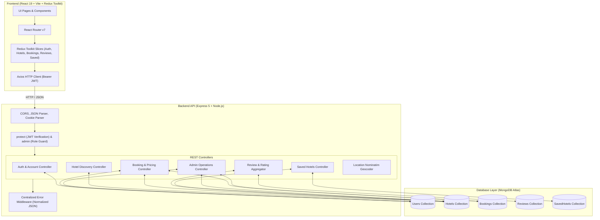

# StayNest

<div align="center">

### Find a place that feels like yours.

StayNest is a polished full-stack hotel discovery and reservation platform built with the MERN stack. Search distinctive stays, save favourites, book with transparent pricing, and manage the whole experience from one calm, focused interface.
##Live Preview: https://staynest-eight-zeta.vercel.app/

[](#deploy-to-vercel)
[](https://staynest-backend-tawny.vercel.app/api/health)
[](#running-test-suites)
[](backend/package.json)

**React 19** · **Express 5** · **MongoDB Atlas** · **JWT Auth** · **Tailwind CSS v4**

</div>

<p align="center">
   
</p>

## Why StayNest?

StayNest brings the essential hotel journey into one cohesive product:

| Discover | Decide | Stay in control |
|---|---|---|
| Search by destination, price, rating, amenity, or keyword. | Compare galleries, rooms, reviews, and server-calculated totals. | Save hotels, manage bookings, update your profile, and review stays. |

<details>
<summary><strong>Quick navigation</strong></summary>

- [Feature tour](#features)
- [Local setup](#local-setup--development)
- [Deploy to Vercel](#deploy-to-vercel)
- [Environment variables](#environment-variables)
- [API reference](#api-endpoints-reference)
- [Test suite](#running-test-suites)

</details>

> [!NOTE]
> Replace the deployment links above with your own Vercel URLs when publishing your fork.

## Table of Contents
- [Features](#features)
- [Tech Stack](#tech-stack)
- [System Architecture](#system-architecture)
- [Folder Structure](#folder-structure)
- [MongoDB Atlas Setup](#mongodb-atlas-setup)
- [Environment Variables](#environment-variables)
- [Local Setup & Development](#local-setup--development)
- [Running Test Suites](#running-test-suites)
- [API Endpoints Reference](#api-endpoints-reference)
- [Core Workflows](#core-workflows)
  - [Authentication & Role-Based Access](#authentication--role-based-access)
  - [Hotel Discovery & Geocoding Search](#hotel-discovery--geocoding-search)
  - [Booking System & Price Calculation](#booking-system--price-calculation)
  - [Review Aggregation Engine](#review-aggregation-engine)
  - [Administrative Dashboard](#administrative-dashboard)
- [Screenshots](#screenshots)
- [Deploy to Vercel](#deploy-to-vercel)
- [Security & Best Practices](#security--best-practices)

---

## Features

### 1. User Authentication & Profile Governance
- Secure account registration and credential-based login.
- JWT-based session verification with `Authorization: Bearer <token>` and cookie support.
- Passwords salted and hashed with **bcryptjs** (10 salt rounds), never exposed in JSON responses.
- User profile updates (name, avatar, currency preference: PKR, USD, EUR, GBP, notification toggles).
- Authenticated password change with verification of current password and mismatch guards.
- Protected client-side and server-side routes (`RequireAuth`, `RequireAdmin`, `protect`, `admin`).

### 2. Hotel Discovery & Multi-Criteria Search
- Instant free-text search across hotel name, city, and description.
- Location search with automatic city resolution via **OpenStreetMap Nominatim** geocoding.
- Granular filtering by price range (`minPrice`, `maxPrice`), star rating (1–5 stars), and amenities.
- Dynamic sorting: **Featured**, **Price: Low to High**, **Price: High to Low**, **Top Rated**, **Most Popular**, and **Newest**.
- Clean pagination support (`page`, `limit`).
- Resilient image gallery powered by `UnsplashImage` with automatic error fallback.

### 3. Booking Engine & Pricing Integrity
- Interactive room type selection (Standard, Deluxe, Executive Suite, etc.).
- Strict date validation: check-in must precede check-out, with real calendar date parsing.
- Guest and room count constraints (positive integer validation).
- **Server-Authoritative Price Calculation**: Total price is recalculated on the backend using the hotel's stored rate per night, number of nights, and room count. Client-supplied price tampering is discarded.
- Reservation lifecycle states: `pending` → `confirmed` → `completed` or `cancelled`.
- Ownership-scoped queries: guests can only view and cancel their own reservations.

### 4. Verified Guest Reviews & Rating Engine
- Authenticated guests can submit 1–5 star ratings and reviews.
- **Duplicate Prevention**: Compound database index (`user + hotel`) prevents duplicate reviews.
- Automatic rating recomputation: creating, editing, or deleting a review recalculates the hotel's average star rating and review count.
- Review owners can edit and delete their own feedback.

### 5. Bookmarked / Saved Hotels
- Guests can save/bookmark hotels with one-click toggles.
- Compound unique index ensures idempotent save operations.
- Dedicated Saved Hotels page with direct navigation and removal actions.

### 6. Administrative Dashboard & Analytics
- Platform overview with live aggregate metrics: Total Users, Total Hotels, Total Bookings, and Total Revenue (calculated from confirmed and completed bookings).
- **Full Hotel CRUD**: Create new properties, edit details via an integrated modal, toggle active/inactive visibility, and delete properties.
- **Booking Management**: Real-time listing of all guest reservations, filterable by status, with instant status transitions (`pending`, `confirmed`, `completed`, `cancelled`).
- **User Audit**: Directory of registered accounts, roles (`user`, `admin`), and registration timestamps.
- Role enforcement: non-admin tokens receive `403 Forbidden`.

### 7. Resilient Error Handling & UX
- Centralized Express error handler normalizing Mongoose `ValidationError`, `CastError`, duplicate key `11000`, and JWT errors into consistent `{ success: false, message: ... }` responses.
- Custom client-side `404 Not Found` page for unmatched routes.
- Polished loading skeletons, error banners, and empty state illustrations across all pages.

---

## Tech Stack

| Layer | Technologies |
|---|---|
| **Frontend** | React 19, Vite, Tailwind CSS v4, Redux Toolkit, React Router v7, Axios, Lucide React |
| **Backend** | Node.js, Express.js 5, MongoDB Atlas, Mongoose 9, JWT (`jsonwebtoken`), bcryptjs, cookie-parser, CORS, dotenv |
| **External APIs** | OpenStreetMap Nominatim (Geocoding), Unsplash API (Resilient imagery fallback) |
| **Testing** | Node.js test runner suite (112 automated assertions across 7 modules) |

---

## System Architecture



---

## Folder Structure

```
StayNest/
├── README.md                           # Master documentation
├── backend/                            # Node.js + Express + Mongoose API
│   ├── .env.example                    # Backend environment template
│   ├── package.json                    # Backend dependencies & test scripts
│   ├── src/
│   │   ├── app.js                      # Express application & route mounts
│   │   ├── server.js                   # Server bootstrap & DB connection
│   │   ├── config/
│   │   │   └── db.js                   # MongoDB Atlas Mongoose connection
│   │   ├── controllers/
│   │   │   ├── adminController.js      # Stats, admin hotel CRUD, booking statuses
│   │   │   ├── authController.js       # Auth, profile, password change, users
│   │   │   ├── bookingController.js    # Create booking, price calc, user bookings
│   │   │   ├── hotelController.js      # Public hotel search, filters, details
│   │   │   ├── locationController.js   # OpenStreetMap geocoding endpoint
│   │   │   ├── reviewController.js     # Reviews & aggregate rating engine
│   │   │   └── savedController.js      # User bookmarks
│   │   ├── middleware/
│   │   │   ├── admin.js                # Role guard (admin only)
│   │   │   ├── auth.js                 # JWT bearer token verification
│   │   │   └── error.js                # Centralized error handler & 404 catch
│   │   ├── models/
│   │   │   ├── Booking.js              # Booking schema & lifecycle statuses
│   │   │   ├── Hotel.js                # Hotel schema & query indexes
│   │   │   ├── Review.js               # Review schema & compound index
│   │   │   ├── SavedHotel.js           # SavedHotel schema & compound index
│   │   │   └── User.js                 # User schema & bcrypt pre-save hook
│   │   └── utils/
│   │       ├── AppError.js             # Custom operational error class
│   │       ├── generateToken.js        # JWT signer
│   │       └── geocode.js              # Nominatim geocoding helper
│   └── tests/                          # Automated test suites (Node.js fetch)
│       ├── account.test.mjs            # Profile & password tests
│       ├── admin.test.mjs              # Admin statistics, CRUD & status tests
│       ├── auth.test.mjs               # Authentication & token verification tests
│       ├── booking.test.mjs            # Booking, pricing & permission tests
│       ├── hotel.test.mjs              # Hotel search, filter & detail tests
│       ├── reviews.test.mjs            # Review CRUD & rating calculation tests
│       ├── run-all.mjs                 # Master test suite runner
│       └── saved.test.mjs              # Bookmarking & uniqueness tests
└── frontend/                           # React 19 + Vite SPA
    ├── .env.example                    # Frontend environment template
    ├── index.html                      # HTML entry
    ├── package.json                    # Frontend dependencies & build script
    ├── vite.config.js                  # Vite configuration
    └── src/
        ├── App.jsx                     # Route definitions & guards
        ├── main.jsx                    # React root & Redux Provider
        ├── index.css                   # Global styles & design system tokens
        ├── app/
        │   ├── store.js                # Redux Toolkit store
        │   └── api/                    # API client modules (admin, hotel, booking)
        ├── components/
        │   ├── RequireAdmin.jsx        # Admin route protection wrapper
        │   ├── RequireAuth.jsx         # Auth route protection wrapper
        │   ├── account/                # Profile, Security, Preferences tabs
        │   ├── bookings/               # BookingForm, BookingCard
        │   ├── hotels/                 # HotelCard, HotelFilters, HotelSkeleton
        │   ├── layout/                 # Navbar, Footer, Layout
        │   ├── reviews/                # ReviewsSection, ReviewForm
        │   └── ui/                     # Button, Card, StarRating, StatusBadge, UnsplashImage
        ├── features/                   # Redux slices (auth, hotels, bookings, reviews, saved)
        ├── hooks/                      # Custom hooks (useSaved)
        ├── pages/                      # Application views
        │   ├── AccountPage.jsx         # Profile management view
        │   ├── AdminPage.jsx           # Administrative dashboard view
        │   ├── BookingConfirmationPage.jsx # Reservation confirmation view
        │   ├── BookingsPage.jsx        # User reservations view
        │   ├── HomePage.jsx            # Hero search & featured properties view
        │   ├── HotelDetailPage.jsx     # Property overview, gallery, reviews
        │   ├── HotelsPage.jsx          # Search results with drawer filters
        │   ├── LoginPage.jsx           # User sign-in
        │   ├── NotFoundPage.jsx        # 404 error page
        │   ├── RegisterPage.jsx        # User registration
        │   └── SavedPage.jsx           # Bookmarked properties
        └── services/
            ├── location.js             # Formatting & geocoding helper
            └── unsplash.js             # Fallback image search service
```

---

## MongoDB Atlas Setup

1. **Create an Atlas Account**: Visit [mongodb.com/cloud/atlas](https://www.mongodb.com/cloud/atlas) and register for a free cluster (M0).
2. **Deploy a Database**: Select your preferred cloud provider and region, then create your cluster.
3. **Configure Database Access**:
   - Navigate to **Security** → **Database Access**.
   - Click **Add New Database User**.
   - Select **Password Authentication**, set a secure username and password, and grant **Read and write to any database**.
4. **Configure Network Access**:
   - Navigate to **Security** → **Network Access**.
   - Click **Add IP Address**.
   - For development/cloud hosting, select **Allow Access from Anywhere** (`0.0.0.0/0`) or specify your dedicated IP.
5. **Obtain Connection String**:
   - Navigate to **Database** → **Connect** → **Drivers** (Node.js).
   - Copy the URI format:
     ```
     mongodb+srv://<username>:<password>@cluster0.xxxxx.mongodb.net/staynest?retryWrites=true&w=majority
     ```

---

## Environment Variables

### Backend (`backend/.env`)
Create a `.env` file in the `backend/` directory based on `.env.example`:

```env
# Server Port
PORT=5000

# MongoDB Atlas Connection String
MONGODB_URI=mongodb+srv://<username>:<password>@cluster0.xxxxx.mongodb.net/staynest?retryWrites=true&w=majority

# JSON Web Token Secret & Expiration
JWT_SECRET=your_super_secret_jwt_key_minimum_32_characters
JWT_EXPIRES_IN=7d

# Environment
NODE_ENV=development
```

> [!CAUTION]
> Never commit your real `.env` file to version control. The repository `.gitignore` automatically excludes all `.env` files.

### Frontend (`frontend/.env`)
Create a `.env` file in the `frontend/` directory based on `.env.example`:

```env
# Backend API Base URL
VITE_API_URL=http://localhost:5000/api

# Optional Unsplash API Access Key (for resilient image search)
VITE_UNSPLASH_ACCESS_KEY=your_unsplash_access_key
```

---

## Local Setup & Development

### Prerequisites
- Node.js 18.x or higher
- npm 9.x or higher
- MongoDB Atlas account with a running cluster

### Step 1: Install Dependencies
```bash
# Install backend dependencies
cd backend
npm install

# Install frontend dependencies
cd ../frontend
npm install
```

### Step 2: Configure Environment Variables
Copy `.env.example` to `.env` in both `backend` and `frontend` folders and populate the values.

### Step 3: Run the Backend
```bash
cd backend
npm run dev
# Server will start on http://localhost:5000
# Health check: http://localhost:5000/api/health
```

### Step 4: Run the Frontend
```bash
cd frontend
npm run dev
# Application will launch on http://localhost:5173 or http://localhost:3000
```

---

## Running Test Suites

StayNest includes an end-to-end automated test suite covering all 6 CRUD resources, authentication flows, authorization boundaries, date validations, price calculations, and rating recomputations.

```bash
# Run all test suites
cd backend
npm test
```

### Test Suites Breakdown

| Test Suite | Assertions | Focus Areas |
|---|---|---|
| `auth.test.mjs` | 13 | Register, duplicate email guard, valid login, invalid password, protected routes, admin role promotion & rejection, logout |
| `account.test.mjs` | 11 | Update profile (name, currency preference), update email, change password, login with new password, old password rejection |
| `hotel.test.mjs` | 16 | Public listing, city filter, price bounds, text search, rating filter, priceAsc sorting, pagination, detail by ID, invalid ID 400, 404 |
| `booking.test.mjs` | 17 | Create booking, server-side price calculation, client-tampered price rejection, invalid dates, guest/room validation, cancel booking, unauthorized access 404 |
| `reviews.test.mjs` | 20 | Create review, rating range validation (1–5), duplicate review idempotency, hotel average rating recompute, owner update, owner delete |
| `saved.test.mjs` | 13 | Bookmark hotel, duplicate save idempotency, list saved hotels, remove saved hotel, user isolation, database unique compound index |
| `admin.test.mjs` | 22 | Admin stats & revenue, admin hotel create, admin hotel update/toggle, admin hotel delete, list all bookings, update booking status, list users |
| **Total** | **112** | **100% Pass Rate** |

---

## API Endpoints Reference

### Authentication & Account (`/api/auth`)
| Method | Endpoint | Access | Description |
|---|---|---|---|
| `POST` | `/api/auth/register` | Public | Register a new user account |
| `POST` | `/api/auth/login` | Public | Authenticate user & return JWT |
| `POST` | `/api/auth/logout` | Public | Logout current user session |
| `GET` | `/api/auth/me` | Protected | Get authenticated user profile |
| `PUT` | `/api/auth/profile` | Protected | Update profile information & preferences |
| `PUT` | `/api/auth/change-password` | Protected | Update account password |

### Hotels (`/api/hotels`)
| Method | Endpoint | Access | Description |
|---|---|---|---|
| `GET` | `/api/hotels` | Public | List hotels with filtering, sorting & pagination |
| `GET` | `/api/hotels/:id` | Public | Retrieve single hotel details |
| `POST` | `/api/hotels` | Admin | Create a new hotel |
| `PUT` | `/api/hotels/:id` | Admin | Update hotel details |
| `DELETE` | `/api/hotels/:id` | Admin | Delete a hotel |

### Reviews (`/api/hotels/:hotelId/reviews` & `/api/reviews`)
| Method | Endpoint | Access | Description |
|---|---|---|---|
| `GET` | `/api/hotels/:hotelId/reviews` | Public | List all reviews for a property |
| `POST` | `/api/hotels/:hotelId/reviews` | Protected | Submit a 1–5 star review |
| `PUT` | `/api/reviews/:id` | Protected (Owner) | Update own review |
| `DELETE` | `/api/reviews/:id` | Protected (Owner) | Delete own review |

### Bookings (`/api/bookings`)
| Method | Endpoint | Access | Description |
|---|---|---|---|
| `POST` | `/api/bookings` | Protected | Book a stay (server-calculated price) |
| `GET` | `/api/bookings` | Protected | List current user's reservations |
| `GET` | `/api/bookings/:id` | Protected (Owner) | View booking confirmation |
| `PUT` | `/api/bookings/:id/cancel` | Protected (Owner) | Cancel an eligible reservation |

### Saved Hotels (`/api/saved`)
| Method | Endpoint | Access | Description |
|---|---|---|---|
| `POST` | `/api/saved` | Protected | Bookmark a hotel (idempotent) |
| `GET` | `/api/saved` | Protected | List current user's saved hotels |
| `DELETE` | `/api/saved/:hotelId` | Protected | Remove hotel from saved list |

### Administrative Management (`/api/admin`)
| Method | Endpoint | Access | Description |
|---|---|---|---|
| `GET` | `/api/admin/stats` | Admin | Dashboard summary (users, hotels, bookings, revenue) |
| `GET` | `/api/admin/hotels` | Admin | List all hotels (including inactive) |
| `POST` | `/api/admin/hotels` | Admin | Create hotel |
| `PUT` | `/api/admin/hotels/:id` | Admin | Update hotel details / toggle active |
| `DELETE` | `/api/admin/hotels/:id` | Admin | Delete hotel |
| `GET` | `/api/admin/bookings` | Admin | List all bookings across all users |
| `GET` | `/api/admin/bookings/:id` | Admin | View full booking details |
| `PUT` | `/api/admin/bookings/:id/status` | Admin | Update reservation status |
| `GET` | `/api/admin/users` | Admin | List all registered user accounts |

### Location Geocoder (`/api/location`)
| Method | Endpoint | Access | Description |
|---|---|---|---|
| `GET` | `/api/location/search?q=<query>` | Public | Resolve free-text location via Nominatim |

---

## Core Workflows

### Authentication & Role-Based Access
1. When a user logs in, the server returns a signed JWT containing the user's ID.
2. The client attaches this token via `Authorization: Bearer <token>` on subsequent requests.
3. The `protect` middleware extracts the token, verifies its signature against `JWT_SECRET`, loads the user document from MongoDB Atlas, and binds it to `req.user`.
4. Role-guarded endpoints execute the `admin` middleware immediately following `protect`, ensuring only users with `role: "admin"` proceed.

### Hotel Discovery & Geocoding Search
1. Users enter search terms into the hero bar or filter panel.
2. If a destination is entered, `/api/location/search?q=...` queries OpenStreetMap Nominatim to resolve the canonical city name.
3. The query is forwarded to `GET /api/hotels` with sanitized regex filtering, price bounds, rating bounds, and sorting options.

### Booking System & Price Calculation
1. The guest selects room type, check-in date, check-out date, guest count, and number of rooms.
2. Upon POSTing to `/api/bookings`, the server looks up the active hotel document to retrieve its authoritative `pricePerNight`.
3. The server computes:
   $$\text{nights} = \lceil(\text{checkOut} - \text{checkIn}) / 86400000\rceil$$
   $$\text{totalPrice} = \text{round}(\text{pricePerNight} \times \text{nights} \times \text{numberOfRooms})$$
4. Any client-sent `totalPrice` is explicitly ignored.

### Review Aggregation Engine
1. Upon posting, editing, or deleting a review, the server executes a MongoDB aggregation pipeline matching all reviews for the given hotel:
   ```javascript
   const result = await Review.aggregate([
     { $match: { hotel: hotelId } },
     { $group: { _id: null, avg: { $avg: '$rating' }, count: { $sum: 1 } } }
   ]);
   ```
2. The resulting average rating (rounded to 1 decimal place) and review count are saved to the Hotel document.

### Administrative Dashboard
1. Admins access the `/admin` route (guarded by `<RequireAdmin>` on frontend and `protect, admin` on backend).
2. The Overview tab displays revenue and counts computed via aggregate queries.
3. The Hotels tab offers search, property creation, inline detail editing, active/inactive toggles, and deletion.
4. The Bookings tab allows status updates (`pending`, `confirmed`, `completed`, `cancelled`).

## Deploy to Vercel

StayNest deploys as two Vercel projects because the React client and Express API have separate build environments.

### Backend project

1. Import the repository and set **Root Directory** to `backend`.
2. Keep the framework preset as **Other**.
3. Add the backend variables below and deploy.
4. Verify `https://<your-backend>.vercel.app/api/health`.

The serverless entry point is [backend/api/index.js](backend/api/index.js), with routing configured in [backend/vercel.json](backend/vercel.json).

### Frontend project

1. Create a second Vercel project from the same repository.
2. Set **Root Directory** to `frontend`.
3. Set **Build Command** to `npm run build` and **Output Directory** to `dist`.
4. Set `VITE_API_URL` to `https://<your-backend>.vercel.app/api`.
5. Deploy.

[frontend/vercel.json](frontend/vercel.json) rewrites client-side routes to `index.html`, so refreshing `/hotels`, `/saved`, or `/account` works correctly.

### Vercel environment variables

**Frontend**

```env
VITE_API_URL=https://<your-backend>.vercel.app/api
VITE_UNSPLASH_ACCESS_KEY=<optional_unsplash_access_key>
```

**Backend**

```env
MONGODB_URI=mongodb+srv://<user>:<password>@<cluster>/<database>?retryWrites=true&w=majority
JWT_SECRET=<long_random_production_secret>
JWT_EXPIRES_IN=7d
NODE_ENV=production
```

`PORT` is not required for Vercel serverless functions.

---

## Security & Best Practices
- **No Hardcoded Secrets**: All keys, connection strings, and tokens are read directly from `process.env`.
- **Password Protection**: Passwords have `select: false` on the User model and are stripped by the `toJSON` transform.
- **Resource Ownership**: Endpoints manipulating user-specific records (bookings, saved hotels, reviews) query with `user: req.user._id` to eliminate ID enumeration attacks.
- **Input Sanitization**: Free-text regex inputs are escaped to prevent ReDoS (Regular Expression Denial of Service).
- **CORS Configured**: Cross-Origin Resource Sharing is enabled for authorized origins.
- **Strict Validation**: All incoming payloads are validated before database writes.
